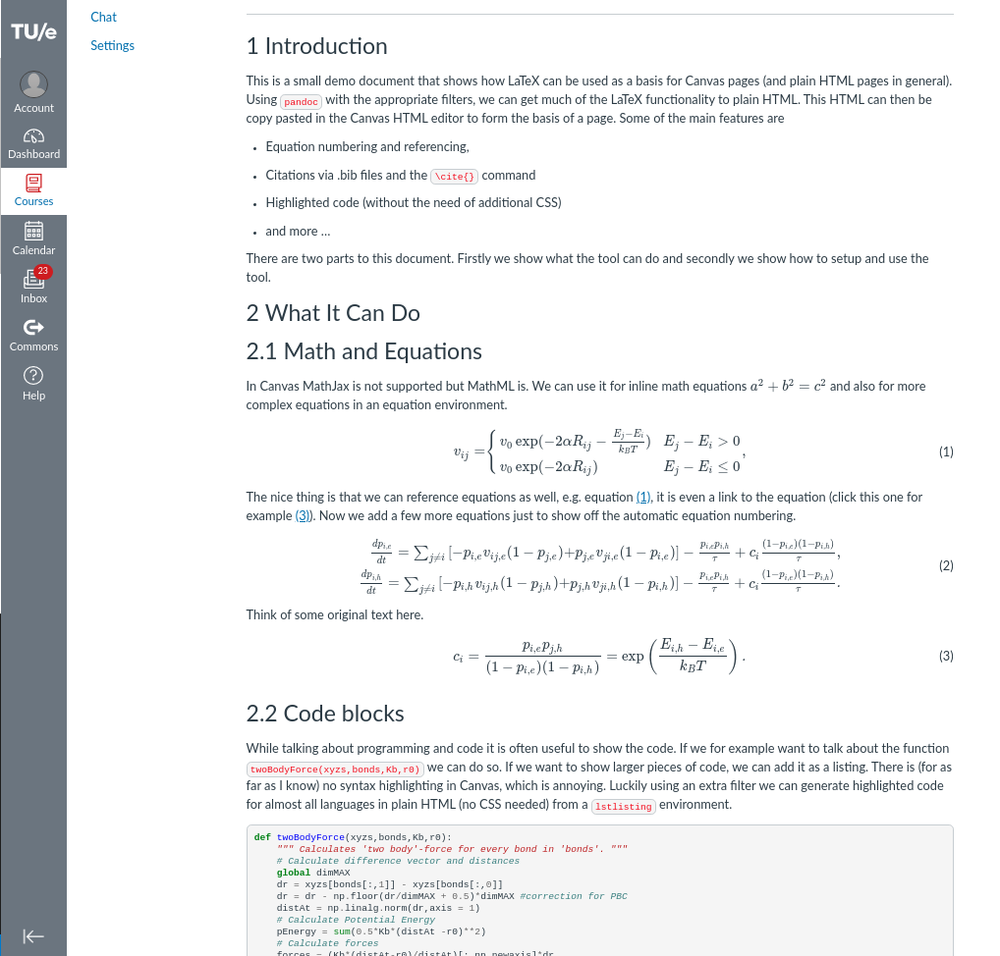

# Latex To Canvas LMS Pages
This tool converts LaTeX (.tex) files to plain HTML that can be used as a basis for pages in Canvas LMS.

Some of the features 

* Syntax highlighting for code
* Equation numbers and referencing
* Automatic table of contents

# Usage
The tool is made to be as easy as possible, to see what it can do run

```bash
./texToHtml.py input.tex
```
or on windows
```bash
python3 texToHtml.py input.tex
```

This will create a html page called `output.html`, the contents of this file can be copy pasted in the HTML editor of a Canvas page or viewed in a browser (NB in the last case not all features might work). The generated page will give a more detailed explanation of what the tool can do and how to customize the output.

### Example output (page fragment)


# Dependencies
The tool is made in python and based around pandoc, hence a working python version is necessary. Pandoc can be installed via this [link](https://pandoc.org/installing.html), there is an installer, but also instructions for how to do it via the command line.
	
The syntax highlighting and equation numbering depend on two other python packages `pandocfilters` and `pygments`. They can be installed with `pip3 install <package_name>`

## Files
Every pandoc filter and template has its own file, these files should be accessible to the program while running. The easiest way to achieve this is by putting them in the working directory. The files needed are	
* `highlightCode.py` provides syntax highlighting
* `addEquationNumbers.py` provides equation numbers
* `canvasTemplate.html` provides a template for the page we generate. In the example template I have used it to set the width of the page to 900 pixels.
